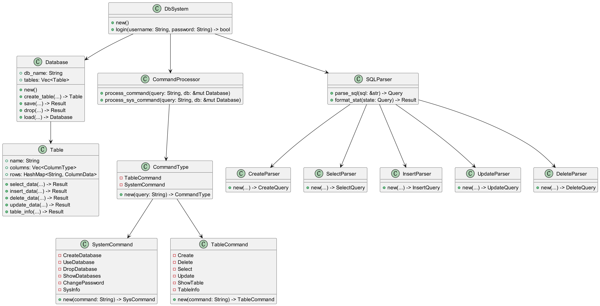
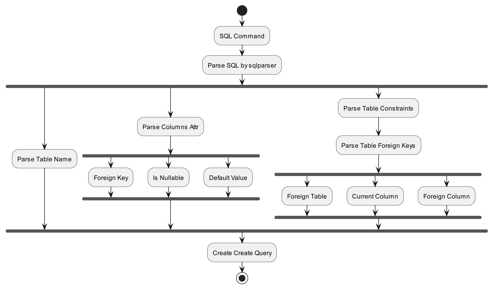
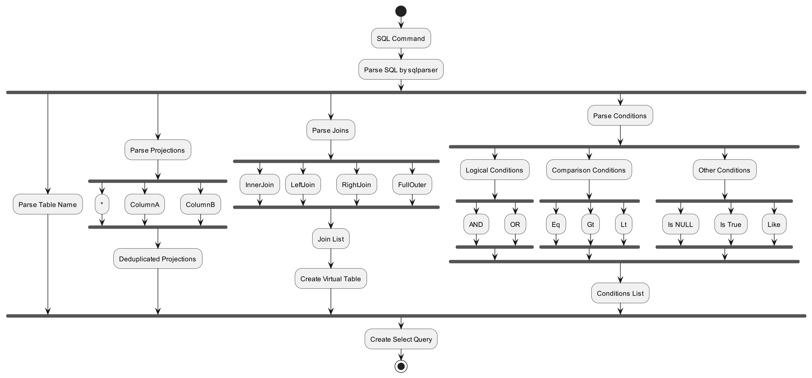
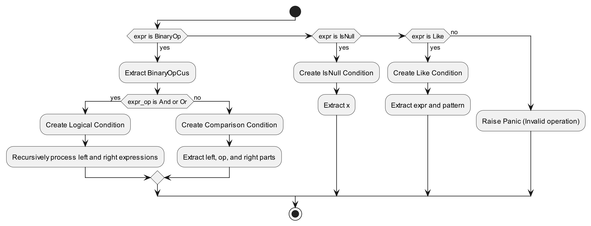

# SimpleDB based on Rust
[Original Repo: https://github.com/DMSintalor/simple-db.git](https://github.com/DMSintalor/simple-db.git)

[](LICENSE)
[](Stars)
[](Forks)


## Overview

This is a database system developed based on Rust, which currently supports basic database operations and instructions,
supports persistent storage, and is compatible with MySQL syntax.

## Getting Start

To get started with RustDB, follow these steps:

1. Visit [Rust's official website](https://www.rust-lang.org/) to install the basic environment required for running
   Rust programs.

2. Clone this repository to your local machine:

    ```bash
    $ git clone https://github.com/DMSintalor/simple-db.git
    ```

3. Navigate to the project directory:

    ```bash
    $ cd simple-db
    ```

4. Build and install RustDB:
    ```bash
    $ cargo build --release
    ```

5. Execute SimpleDB
   ```bash
   $ cd target/release
   $ run SimpleDB
   ```

**Alternatively, you can use `cargo run` to start the program.**

## Support Commands

- [X] Create Table
- [X] Drop Table
- [X] Select Data
    - [X] Inner Join
    - [X] Multi Conditions
        - [X] ``Like``
        - [X] ``IS NULL``
        - [X] ``< > =``
        - [x] ``And Or``
- [X] Insert Data into Table
- [X] Delete Data from Table
    - [X] Multi Conditions
- [X] Update Data
    - [X] Multi Conditions
- [X] Create New Database
- [X] Change Database
- [X] Drop Database
- [X] Change Password

### How to work

1. SimpleDB-ClassMap
   
2. Create Parser
   
3. Select Parser
   
4. Generate Conditions
   

### Future Work

- [ ] I/O Lock
- [ ] BTree
- [ ] Cloud Storage
- [ ] Data Encryption With RSA
- [ ] Support Python API like SQLAlchemy