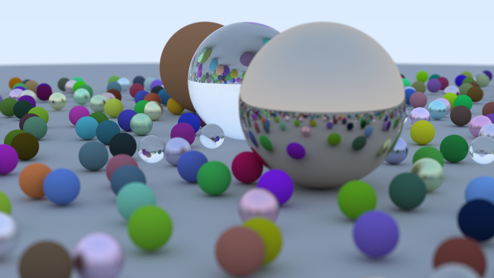
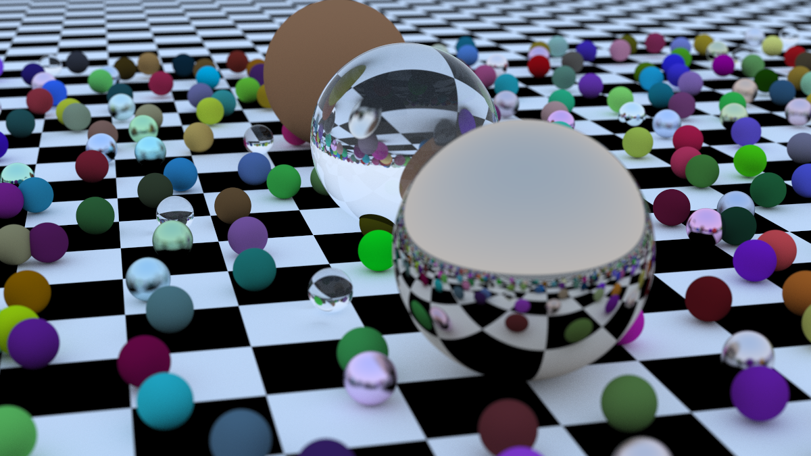

# [Rust Raytracer](https://github.com/clumsy-sy/Rust-Raytracer)

利用 Rust 实现一个光线追踪渲染器，主要的实现内容来自 [Ray Tracing in One Weekend](https://raytracing.github.io/books/RayTracingInOneWeekend.html)，原文是用 C++ 实现的光线追踪渲染器的课程。

## 编译运行

```shell
cargo run --example [文件名(不带 .rs)] --release
```

### 基础

- [x] 实现  [Ray Tracing in One Weekend](https://raytracing.github.io/books/RayTracingInOneWeekend.html) 内所有内容

### 挑战

- [x] 实现 BVH
- [x] 实现**多线程**加速
- [ ] 实现对三角形的支持
- [ ] 实现对 obj 文件的支持
- [ ] 实现 Ray Tracing in One Weekend  —  The Book Series 的第二本，[Ray Tracing: The Next Week](https://raytracing.github.io/books/RayTracingTheNextWeek.html)

### 额外
- [ ] 实现 SIMD 加速
- [ ] 对场景文件 json 的支持
- [ ] 实现 Ray Tracing in One Weekend  —  The Book Series 的第三本，[Ray Tracing: The Rest of Your Life](https://raytracing.github.io/books/RayTracingTheRestOfYourLife.html)
- [ ] 更多图形学技术，例如：BVH-SAH 算法、 BVH 并行化构建、曲面细分、降噪、Physically Based Rendering……


## 图片



**上图信息** 
> CPU： i9-13980HX  
> 图片大小：1200 * 800  
> 单像素采样数：1000  
> 递归深度： 10  
> 运行时间：4:34.41  



## 参考材料

- [The Rust Programming Language](https://doc.rust-lang.org/book/title-page.html)
- [Ray Tracing in One Weekend - The Book Series](https://raytracing.github.io/)
- [Remda：使用 Rust 学习图形学软光追入门教程《Ray Tracing in One Weekend》](https://rustcc.cn/article?id=bffdbc8b-1c99-4d1d-942c-91365b6ada0d)  [Github链接](https://github.com/7sDream/remda)
- [Pseudo Photograph Company of ACM](https://github.com/aik2mlj/raytracer-tutorial)
